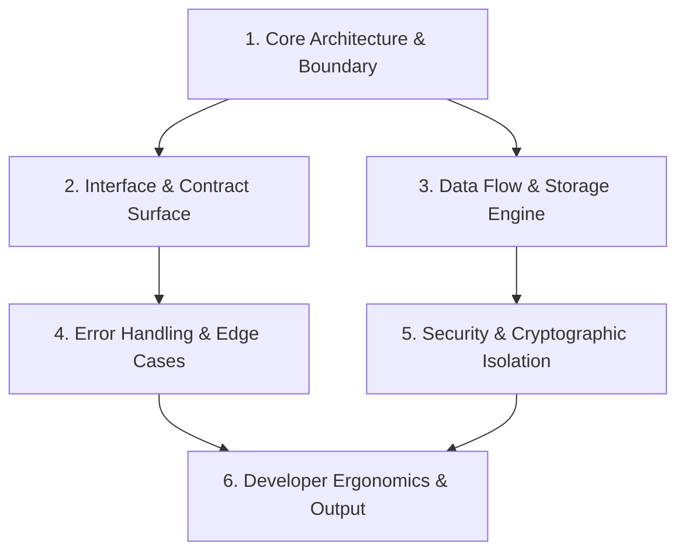

# Question-Me — Interactive Design Tree Resolution Protocol

> **Protocol Stance:** Interview the operator about every aspect of the task until a shared understanding is reached — walk down each branch of the design tree, resolving dependencies one-by-one; provide recommended answers; ask one question at a time; explore the codebase first.
>
> **Environment-Agnostic Delivery:** Conducts the interview through whatever interaction surface the running environment offers — native structured question tools, interactive terminal prompts, or autonomous subagent orchestration — without depending on any specific model, platform, or tooling vendor.

---

## 1. Core Doctrine: The 6 Pillars

1. **Reconnaissance Before Interrogation (Zero Lazy Questions):**
   Never ask the operator a question that the codebase already answers. Before asking anything, inspect git context, the `llms.txt` DOX chain, existing symbols, configurations, dependency manifests, and architectural conventions. If a fact is discoverable from code, establish it as an **Anchor Fact** without bothering the operator.
2. **Topological Dependency Order (Walk the Tree):**
   Structure requirements as a directed tree. Resolve parent architectural decisions before probing child implementation details (e.g., decide *system architecture* before *CLI flag naming*). Downstream branches adapt or prune automatically when upstream decisions change.
3. **Strict Monadic Flow (One Question at a Time):**
   Never barrage the operator with multi-part questions or bulleted checklists. Ask exactly **one** focused question per interaction turn. Await the response, log the decision, update the decision tree, and proceed to the next dependent node.
4. **Opinionated Guidance (Always Recommend):**
   Every question must present concrete, mutually exclusive options, with the optimal choice clearly marked `(Recommended)` and substantiated by engineering rationale, architectural fit, and project standards. The operator can choose to accept the recommendation with a single click/keystroke or choose an alternative.
5. **Environment-Agnostic Delivery:**
   - **Native Structured Questions:** When the environment exposes a structured question tool, deliver the interview through it — options first, recommendation first, user-perspective phrasing, and markdown file links.
   - **Interactive Terminal Prompts:** When no native question tooling exists, output a structured, high-visibility interactive prompt with numbered choices, highlighted recommendations, and write-in support.
   - **Subagent Delegation:** Orchestrator locks design via `question-me` before dispatching implementation or test subagents.
6. **Living Design Artifact:**
   Maintain an active session artifact (`.agents/tasks/{date}-question-me-{slug}.md` or conversation artifact). Every answer logs immediately into the Decision Ledger, building toward a final, airtight **Implementation Blueprint** before any code is touched.

---

## 2. Activation Triggers

Invoke or recommend `question-me` when:
- **Operator Invocation:** User runs `/question-me`, or asks to "interview me", "grill me", "help me plan this", or "align on the architecture first".
- **High Ambiguity / Underspecified Scope:** The operator's request has multiple plausible architectural interpretations, missing contracts, or unspecified edge cases.
- **Architectural Fork:** Introducing a new subsystem, choosing between data models, selecting wire protocols, or changing storage layers.
- **Security / PQC / Crypto Decisions:** Introducing secrets handling, authentication flows, or cryptographic primitives (enforcing FIPS 203/204/205).
- **Breaking API Changes:** Modifying public interfaces, CLI flag surfaces, or data schemas that impact downstream consumers.

---

## 3. The 4-Phase Operational Loop

```
┌─────────────────────────┐
│ Phase 0: Reconnaissance │ ➔ Codebase truth, DOX chain, git status
└───────────┬─────────────┘
            ▼
┌─────────────────────────┐
│ Phase 1: Tree Scaffolding│ ➔ Construct hierarchical decision tree
└───────────┬─────────────┘
            ▼
┌─────────────────────────┐
│ Phase 2: Socratic Walk  │ ➔ One question at a time with (Recommended)
└───────────┬─────────────┘
            ▼
┌─────────────────────────┐
│ Phase 3: Blueprint Lock │ ➔ Final verified plan & worktree dispatch
└─────────────────────────┘
```

---

### Phase 0: Codebase Reconnaissance & Fact Anchoring

Before drafting the first question, execute passive observation:
1. **Tree & Branch Check:** Inspect `git status`, `git branch --show-current`, and `git worktree list`.
2. **DOX Chain Walk:** Read repo `llms.txt` and nearest child contracts to absorb conventions and constraints.
3. **Codebase Exploration:** Use `grep_search`, `find_by_name`, or `view_file` to inspect existing patterns:
   - What libraries and dependencies are already pinned?
   - How are similar features implemented elsewhere in this repo?
   - What error-handling and logging paradigms are standard?
4. **Anchor Facts Extraction:** Record known facts in the session ledger:
   ```markdown
   ### Anchor Facts (Established from Codebase Truth)
   - Language/Runtime: Python 3.11 / Rust 2024 / TypeScript 5.6
   - Crypto Standard: FIPS 203 ML-KEM-768 for secrets; FIPS 204 ML-DSA-65 for signing
   - Persistence: Local JSON files in ~/.config/ainish-coder/ (no SQLite in this package)
   - Existing CLI Framework: Bash molecular dispatch / clap 4.5
   ```
   *Rule: Never ask a question whose answer is already an Anchor Fact.*

---

### Phase 1: Design Decision Tree Construction

Organize the remaining uncertainties into a strict hierarchical dependency tree.



#### Canonical Decision Levels:
1. **Level 1: System Archetype & Boundary:** (CLI vs. Library vs. Daemon vs. MCP Tool)
2. **Level 2: Contract & Interface:** (JSON schema, CLI flags, function signature, sync vs. async)
3. **Level 3: Storage & State:** (Stateless, filesystem config, memory cache, bundle format)
4. **Level 4: Security & Compliance:** (PQC keys, Zero-Trust validation, permission boundaries)
5. **Level 5: Ergonomics & Polish:** (Output formatting, TTS notifications, verbosity levels)

---

### Phase 2: The Socratic Walk (One Question at a Time)

Walk depth-first down each branch. For each node in the tree:

#### Question Rules:
1. **Format as the user's direct response:** Options must read naturally from the operator's point of view (e.g., *"Store configuration in `~/.config/app/config.json`"* rather than *"You should store configuration..."*).
2. **Put `(Recommended)` first:** Always provide a strong technical recommendation as the first option, accompanied by a brief rationale explaining why it aligns best with existing patterns and quality gates.
3. **No trivial Yes/No questions:** If a decision is binary, elevate it into trade-off alternatives with clear technical consequences.
4. **Include File/Symbol Markdown Links:** When referencing files or symbols, use clickable links: `[config.json](file:///path/to/config.json)` or [`Parser`](file:///path/to/parser.rs#L25-L40).
5. **Prune Dependent Leaves:** If the operator selects Option B that renders downstream questions obsolete, instantly prune those questions from the tree.

#### Question Delivery Modalities:

##### Modality A: Native Structured Question Tooling
When the environment provides a native structured question tool, deliver questions through it:

```json
{
  "questions": [
    {
      "question": "Which interface should expose the new Question-Me protocol?",
      "options": [
        "(Recommended) Dual-channel: Expose both as an automated CLI subcommand (`ainish-coder --question-me`) and as a reusable agent skill in `.agents/skills/question-me/`.",
        "Skill only: Keep it strictly inside `.agents/skills/question-me/` for agent discovery without adding a CLI binary flag.",
        "CLI only: Implement it exclusively as a shell utility in `bin/` without publishing it to target repos as an agent skill."
      ],
      "is_multi_select": false
    }
  ]
}
```

##### Modality B: Interactive Terminal / Headless Delivery
When running in environments without structured question tooling (pure terminal or headless contexts):

```text
================================================================================
[QUESTION-ME] Decision 2/5: Interface & Invocation Model
Target Branch: Interface & Contract Surface
================================================================================
How should the operator trigger the Question-Me interview workflow?

  [1] (Recommended) Slash-command alias & CLI flag: Support `/question-me`
      and `ainish-coder --question-me [DIR]`.
      Rationale: Maximum ergonomics across IDE chat, slash commands,
      and standalone scriptable terminals.

  [2] Slash command only: Restrict to chat-level `/question-me` invocation.
      Trade-off: Simpler surface, but unusable in non-interactive scripts.

  [3] Automatic trigger: Automatically prompt when task ambiguity score > 70%.
      Trade-off: Proactive, but risk of interrupting operators on quick tasks.

  [Custom] Type your custom requirement or press Enter for [1]:
================================================================================
```

##### Modality C: Subagent Master Handoff
When an orchestrator dispatches a task to a subagent (e.g. a headless subagent run carrying an implementation master prompt):
- The orchestrator runs `question-me` with the operator *first*.
- The resulting resolved Decision Ledger is embedded directly into the subagent's task file (`/tmp/task_ast.md` or `.agents/tasks/`).
- The subagent receives zero ambiguity, zero open architectural forks, and a locked specification.

---

### Phase 3: Blueprint Lock & Implementation Hand-off

Once all branches reach terminal leaf nodes:
1. **Compile the Implementation Blueprint:** Summarize all decisions into an immutable, actionable specification.
2. **Present the Blueprint:** Show the operator the exact worktree, target files, acceptance criteria, and quality gates.
3. **Execute via Worktree Gate:** Proceed into implementation per the repository's `AGENTS.md` workflow.

```markdown
# Implementation Blueprint: Question-Me Protocol
- **Date:** 2026-09-07
- **Worktree:** `feat/skills-question-me` (isolated from `main`)
- **Resolved Decisions:**
  1. Scope: Standalone skill pack `.agents/skills/question-me/` deployed via `--skills`.
  2. Interaction Mode: Adaptive delivery (native structured question tools when available, otherwise interactive terminal prompts).
  3. Archetypes: Include 6 pre-built decision tree templates in `references/`.
  4. Anti-Patterns: Include exhaustive negative examples in `references/anti-patterns.md`.
- **Target Files:**
  - `.agents/skills/question-me/SKILL.md`
  - `.agents/skills/question-me/references/decision-tree-templates.md`
  - `.agents/skills/question-me/references/anti-patterns.md`
  - `README.md` (Skills catalog table)
  - `src/help.sh` (Skill pack enumeration)
  - `llms.txt` (DOX index count sync)
- **Quality Gates:** `python3 bin/security_gate.py` (PASS), `bash bin/ainish-coder --help` (PASS).
```

---

## 4. Question Formulation Standards

### Anatomy of an Elite Question
Every question produced by `question-me` must satisfy five tests:
- **Test 1: Specificity:** Does it name concrete architectural entities, paths, or protocols?
- **Test 2: Exclusivity:** Are the options genuinely distinct technical paths, rather than false dichotomies?
- **Test 3: Rationale-backed:** Does the `(Recommended)` option explain *why* based on codebase constraints?
- **Test 4: User-centric Voice:** Are options written from the user's perspective (`"Deploy as a module"`, not `"I will deploy..."`)?
- **Test 5: Non-redundancy:** Could this question have been answered by running `git status` or checking `package.json`?

### Comparison Table: Poor vs. Elite Questions

| Category | ❌ Poor Question (Rejection) | ✅ Elite Question (Question-Me Standard) |
|---|---|---|
| **Ambiguity** | "How do you want to handle errors?" | "When an upstream API returns HTTP 502/504, how should the CLI retry?<br>1. (Recommended) Exponential backoff with jitter up to 3 attempts, then exit with code 2.<br>2. Fail fast immediately without retry.<br>3. Infinite retry loop until operator presses Ctrl+C." |
| **Bikeshedding** | "What should the function name be?" | *(Do not ask; adopt repo convention e.g. `sync_state()` or `resolve_tree()`)* |
| **Lazy Discovery** | "Are you using TypeScript or Rust for this project?" | *(Do not ask; read `Cargo.toml` or `package.json` during Phase 0)* |
| **Multi-Part Barrage** | "What database should we use, how should we seed it, and where will backups live?" | Split into 3 dependency-ordered turns. Question 1: Database engine. Await answer. Question 2: Backup architecture. Await answer. Question 3: Seeding strategy. |
| **Unopinionated** | "Here are 4 options. Which one do you prefer?" | List options with Option 1 marked `(Recommended)` with explicit reasoning linking back to system goals. |

---

## 5. Security & Cryptographic Guardrails

1. **Zero Secret Exposure:** Never ask the operator to input raw API keys, private passwords, or tokens during an interview. If an integration requires authentication, recommend loading via `pqc-secrets` (`~/.config/pqc-secrets/secrets.bundle.json` wrapped with FIPS 203 ML-KEM-768).
2. **PQC Defaulting:** When architectural decisions touch cryptographic integrity or signing, always recommend Post-Quantum algorithms (FIPS 203 for encapsulation, FIPS 204 ML-DSA-65 for signatures, FIPS 205 SLH-DSA for backup signatures) per repo DOX rules.
3. **Least Privilege Scope:** Always recommend minimal file-access and sandbox boundaries when designing new tool or MCP interfaces.

---

## 6. End-of-Session Artifact Template

When `question-me` concludes, persist the decision log into `.agents/tasks/{date}-question-me-{slug}.md`:

```markdown
# Socratic Design Record: {Task Title}
**Session Date:** {ISO-8601}
**Branch/Worktree:** {branch-name}
**Status:** Design Locked / Ready for Implementation

## 1. Anchor Facts (Codebase Truth)
- [Fact 1]
- [Fact 2]

## 2. Decision Tree & Resolution Log
### Decision 1: {Title}
- **Question:** {Prompt text}
- **Selected Option:** {Chosen answer}
- **Trade-offs Accepted:** {Summary of trade-offs}

### Decision 2: {Title}
...

## 3. Implementation Plan & Target Allowlist
- **Editable Files Allowlist:**
  - `path/to/file1`
  - `path/to/file2`
- **Verification Gates:**
  - Gate 1: {Linter/Typecheck}
  - Gate 2: {Unit/Integration Tests}
  - Gate 3: {Security/PQC Audit}
```

---

## 7. Reference Files

- [Decision Tree Templates](references/decision-tree-templates.md) — Pre-built decision tree archetypes for common engineering scenarios.
- [Questioning Anti-Patterns](references/anti-patterns.md) — Catalog of questioning failures and concrete remedies.
