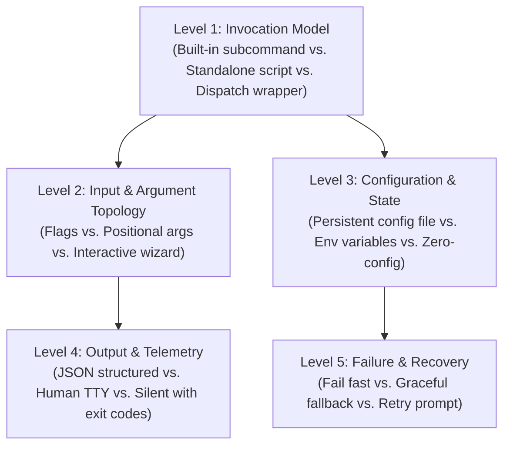
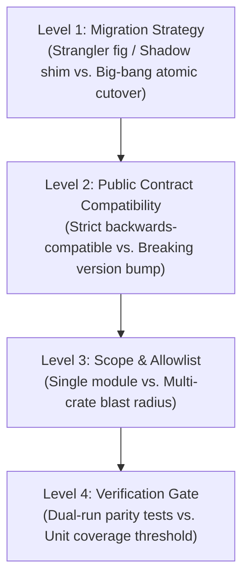
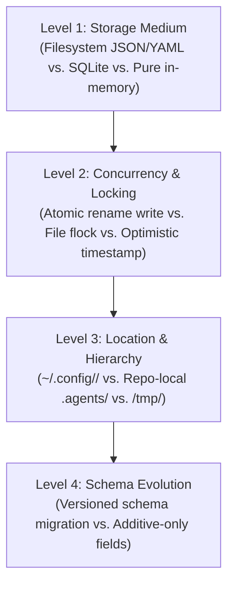
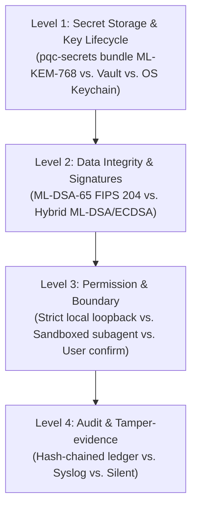
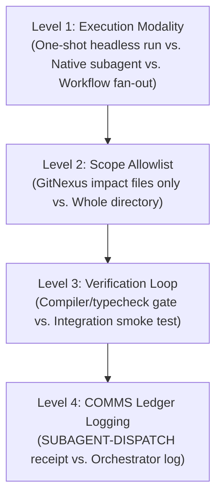

# Decision Tree Templates & Archetypes

This reference catalog provides pre-structured decision tree archetypes for common engineering tasks. Use these templates in **Phase 1** of the `question-me` protocol to construct dependency trees rapidly.

---

## 1. Archetype: New CLI Tool / Subcommand

### Pre-Formulated Questions:
1. **Invocation Model:**
   - *(Recommended)* Subcommand integration: Integrate under the existing root binary CLI dispatch (`ainish-coder --<command>`).
   - Standalone binary: Create a dedicated binary in `bin/<name>` with separate symlink distribution.
   - Shell alias/wrapper: Implement as a lightweight shell function in `src/`.
2. **Input Topology:**
   - *(Recommended)* Positional target path with optional modifier flags (`--force`, `--dry-run`, `--json`).
   - Interactive prompt wizard with arrow navigation when flags are omitted.
   - Environment variable-only configuration.
3. **Output & Ergonomics:**
   - *(Recommended)* Adaptive TTY: Colorful human-readable output on interactive terminals; strict JSON when piped or `--json` is passed.
   - Human text only with ANSI color codes.
   - Minimal silent UNIX style (standard error only on failure).

---

## 2. Archetype: Refactoring & Architecture Migration

### Pre-Formulated Questions:
1. **Cutover Strategy:**
   - *(Recommended)* Strangler / Parallel Facade: Introduce new implementation alongside old, route calls through a shim, verify zero regressions, then deprecate old code.
   - In-place Atomic Refactor: Directly edit and replace existing symbols across target files in a single isolated worktree.
   - Deprecation Shadow: Keep legacy symbols intact under `legacy_` prefix, emit deprecation warnings for 1 cycle.
2. **Contract Preservation:**
   - *(Recommended)* Strict ABI/API Parity: Retain all exported function signatures, return shapes, and error types without breaking changes.
   - Modernized Interface: Adopt cleaner signatures with breaking changes, updating all internal call sites in the same commit.

---

## 3. Archetype: Data Persistence & State Storage

### Pre-Formulated Questions:
1. **Persistence Format:**
   - *(Recommended)* Atomic JSON File: Flat JSON written via write-to-temp-then-atomic-rename (`atomic_write`) for corruption immunity.
   - SQLite / Embedded DB: Embedded database for complex querying and relational lookups.
   - Plaintext key-value / INI store: Simple text format readable by shell tools.
2. **Storage Location:**
   - *(Recommended)* User Configuration Home: `~/.config/<app>/` adhering to XDG Base Directory specification.
   - Repository-Local State: `.agents/` inside the target workspace for project-scoped sharing.
   - Ephemeral Runtime: `/tmp/` or memory cache destroyed on process exit.

---

## 4. Archetype: Security & Cryptography Integration

### Pre-Formulated Questions:
1. **Cryptographic Standard:**
   - *(Recommended)* PQC FIPS 203/204 Mandate: FIPS 203 ML-KEM-768 for secret encryption, FIPS 204 ML-DSA-65 for code and manifest signing.
   - Standard TLS transport crypto with classical TLS 1.3 (strictly for wire transport, never for API keys).
2. **Secret Ingestion:**
   - *(Recommended)* On-demand memory load: Load via `pqc-secrets export` directly into memory with zero disk footprint.
   - System Keychain extraction via OS daemon.

---

## 5. Archetype: Subagent & Autonomous Orchestration

### Pre-Formulated Questions:
1. **Orchestration Modality:**
   - *(Recommended)* Headless Master Run: Dispatch a dedicated headless agent run with an implementation or TDD engineer persona inside an isolated worktree.
   - Native Subagent: Fresh context subagent tool call with read/write isolation.
   - Single-Agent Direct Execution: Execute directly within the current worktree without subagent fan-out.
