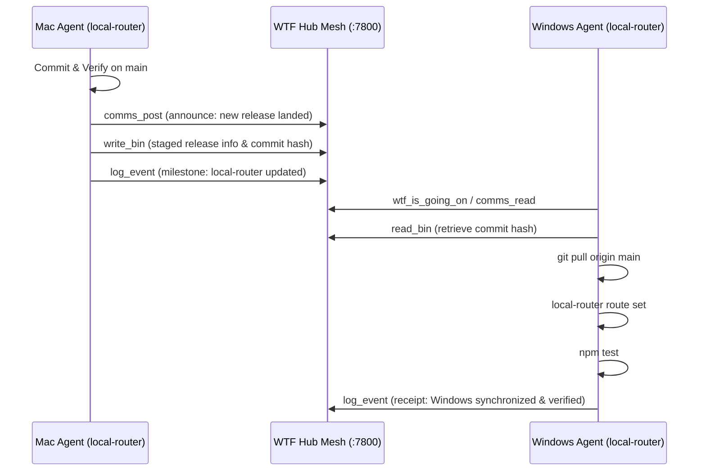

# Federated Fleet Coordination with `local-router` & `wtf-is-going-on-mcp`

**Author:** Antigravity Fleet Orchestrator  
**Date:** 2026-09-02  
**Scope:** `local-router` cross-machine federation, parity synchronization, and subagent fleet orchestration  

---

## 1. Executive Summary & Architectural Overview

The **WTF Federated Fleet** connects distributed physical machines (e.g., macOS dev stations and Windows WSL2 environments) into a unified, privacy-hardened agent mesh. Within this architecture:

1. **`local-router`** serves as the **Singular Model System** running on `http://127.0.0.1:11434`:
   - It proxies the real Ollama daemon on `127.0.0.1:11435`.
   - It hosts the virtual model `local-router/fallback-models` backed by a 24-step multi-provider fallback cascade with Post-Quantum Cryptography (FIPS 203 ML-KEM-768 wrapped keys).
   - It provides single-config routing for the SWE-bench Verified dual coding engines (`trae-cli` and `mini-live`) and interactive chat UIs.
2. **`wtf-is-going-on-mcp`** serves as the **Cross-Machine Observability & Coordination Mesh** on port `7800`:
   - It connects machine hubs (e.g. Mac `hub-799c0c4c` and Windows `hub-2538554f`) over authenticated, federated peering links with ML-KEM-768 key sealing.
   - It provides MCP tools (`wtf_is_going_on`, `check_in`, `log_event`, `read_bin`, `write_bin`, `comms_post`, `comms_read`) allowing agents on any machine to observe, signal, hand off tasks, and verify cross-machine parity.

```
┌──────────────────────────────────────────────────────────────────────────────┐
│                              FEDERATED MESH                                  │
│                                                                              │
│    Mac Station (hub-799c0c4c)                Windows WSL2 (hub-2538554f)     │
│    [192.168.1.68:7800]                       [192.168.1.248:7800]            │
│             │                                         │                      │
│             └─────────── Federated Peering ───────────┘                      │
│                               (E2E Encrypted)                                │
└──────────────────────────────────────┬───────────────────────────────────────┘
                                       │
        ┌──────────────────────────────┴──────────────────────────────┐
        ▼                                                             ▼
┌──────────────────────────────┐              ┌──────────────────────────────┐
│      Mac local-router        │              │    Windows local-router      │
│  http://127.0.0.1:11434/v1   │              │  http://127.0.0.1:11434/v1   │
│  Model: fallback-models      │              │  Model: fallback-models      │
│                              │              │                              │
│  • Headroom Circuit Breaker  │              │  • Headroom Circuit Breaker  │
│    (1500ms timeout / 0ms FO) │              │    (1500ms timeout / 0ms FO) │
│  • PQC Secrets Bundle        │              │  • PQC Secrets Bundle        │
│  • Headless YOLO Fleet       │              │  • Headless YOLO Fleet       │
│  • Ollama on 11435           │              │  • Ollama on 11435           │
└──────────────────────────────┘              └──────────────────────────────┘
```

---

## 2. Key Local-Router Upgrades & Impact on the Fleet

### A. Headroom Context Compression: 0ms Fail-Open Resolution
- **Historical Debt:** As documented in `wtf-is-going-on-mcp/agents.txt` (line 41), the Headroom proxy was previously **DISABLED** on Windows WSL2 because when nothing was listening on port `8787`, requests stalled for 10 seconds per fallback stage, degrading multi-provider fallback.
- **The Upgrade:**
  1. **Strict 1,500ms Fast Timeout:** Reduces worst-case initial probe latency from 10,000ms to 1,500ms.
  2. **Three-State Circuit Breaker (`CLOSED`, `OPEN`, `HALF_OPEN`):** A single timeout or network refusal immediately trips the breaker to `OPEN`. Subsequent requests across all stages fail open instantly with **0ms overhead**.
  3. **30-Second Cooloff:** The breaker remains `OPEN` for 30s before testing a single canary request in `HALF_OPEN` state. If the proxy remains down, it returns to `OPEN` without penalizing client requests.
  4. **WeakMap & LRU Cascade Deduplication:** Prevents repeated compression passes as a request traverses fallback providers, eliminating duplicate token costs and preventing circular JSON serialization crashes.
  5. **Probe Endpoint & UI Indicators:** `POST /api/headroom-config/probe` enables remote health checks.
- **Fleet Impact:** Headroom context compression can now be safely re-enabled across Windows, WSL, and Linux without risk of cascade stalls.

### B. Cross-Platform Auto-Start & Port Separation
- **The Upgrade:** `local-router route set` and `local-router ensure` guarantee that:
  - Local Router starts automatically on launch and owns standard Ollama port `11434`.
  - The real Ollama daemon is redirected to port `11435` via `OLLAMA_HOST=127.0.0.1:11435`.
  - Supervisors are installed across macOS (LaunchAgent), Windows (cmd/ps1 wrappers + Startup), and Linux/WSL2 (`environment.d` + systemd/cron watchdog).
- **Fleet Impact:** Eliminates port collisions and guarantees that any CLI, agent, or web interface on any machine targeting `localhost:11434` is serviced by Local Router.

### C. Trae-Mini Fleet Orchestration & YOLO Headless Execution
- **The Upgrade:**
  - Standardized prompt templates (`TPL_TRAE_AST_V2`, `TPL_MINI_TDD_REPRO_V1`) for the SWE-bench Verified dual engines.
  - Headless YOLO execution flags: `trae-cli run -f <file> --console-type simple` and `mini --yolo --exit-immediately`.
  - Dedicated CLI helper: `scrub_task.py` (privacy redaction for intermediate task/trajectory files).
  - Cross-agent coordination tracked directly in `AGENTS/{date}.COMMS.md`.
- **Fleet Impact:** Subagents executed on any machine follow identical prompt engineering principles and coordinate seamlessly via the shared COMMS ledger.

---

## 3. Coordinated Cross-Machine Synchronization Runbook

To maintain 100% version parity across Mac, Windows, Linux, and WSL2 machines, agents use the **WTF MCP Coordination Protocol**.

### Workflow: Staging and Pulling Updates Across Machines



### Step 1: Pre-Update Discovery via WTF MCP
Before starting a sync or development cycle, the calling agent executes:
```json
// Tool: wtf_is_going_on
{}
```
Check if any other agent is actively modifying `local-router`. Review the E2E COMMS ledger:
```json
// Tool: comms_read
{ "channel": "local-router-ops", "limit": 10 }
```

### Step 2: Publishing a Release Notice
When a verified merge lands on `main` (such as the Headroom circuit breaker or Trae-Mini fleet updates), the updating agent publishes the handoff:

1. **Stage Runbook/Notes in a WTF Bin:**
   ```bash
   # Using wtf CLI or write_bin MCP tool
   wtf bin put 3 --file - <<EOF
   RELEASE: local-router main @ commit $(git rev-parse --short HEAD)
   CHANGES: Headroom circuit breaker (0ms fail-open), YOLO headless fleet templates, route set hardening
   ACTION_REQUIRED: git pull origin main && local-router route set && npm test
   EOF
   ```
2. **Post to COMMS Channel:**
   ```json
   // Tool: comms_post
   {
     "channel": "local-router-ops",
     "action": "announce",
     "scope": "local-router/main",
     "content": "Landed commit $(git rev-parse --short HEAD). Peer machines please pull main and run route set."
   }
   ```
3. **Log Event on the Hub:**
   ```json
   // Tool: log_event
   {
     "level": "info",
     "message": "local-router:main updated with Headroom circuit breaker & fleet dataset"
   }
   ```

### Step 3: Peer Machine Pull & Parity Verification
On the peer machine (e.g. Windows WSL2):
1. **Pull and Re-route:**
   ```bash
   cd ~/code-external/local-router
   git pull origin main
   local-router route set
   ```
2. **Run Full Verification Gates:**
   ```bash
   npm test
   ```
   Ensure all 124 tests pass cleanly.
3. **Re-Enable Headroom (if previously disabled):**
   In `~/.config/local-router/headroom-config.json`, ensure Headroom is active:
   ```json
   {
     "enabled": true,
     "upstreamUrl": "http://127.0.0.1:8787/v1/compress"
   }
   ```
   Verify probe endpoint:
   ```bash
   curl -X POST http://127.0.0.1:11434/api/headroom-config/probe
   # Returns: {"connected":false,"circuitBreaker":"OPEN","failOpen":true} (0ms latency, zero stalls)
   ```

### Step 4: Publish Verification Receipt
Post confirmation to the WTF Hub so the operator and peer agents can confirm parity:
```json
// Tool: log_event
{
  "level": "info",
  "message": "local-router:main parity verified on windows-wsl2 (124/124 tests pass, route set OK)"
}
```

---

## 4. Cross-Machine Subagent Fleet Execution

The federated mesh enables **Distributed Subagent Delegation**: an agent on Mac can instruct an agent on Windows to execute an autonomous SWE subagent dispatch.

### Distributed Task Handoff Protocol:
1. **Task Formulation & Staging (Orchestrator):**
   - Formulates the task using template `TPL_TRAE_AST_V2` or `TPL_MINI_TDD_REPRO_V1`.
   - Writes the task specification into a shared WTF bin (`wtf bin put <N>`).
2. **Task Execution (Worker):**
   - Peer agent reads task from bin (`wtf bin get <N>`).
   - Checks out an isolated task worktree (`git worktree add -b feat/<scope>-<slug> ../<slug>`).
   - Runs `trae-cli run -f /tmp/task.md --console-type simple` or `mini --task ... --yolo` targeting `http://localhost:11434/v1`.
3. **Privacy Scrubbing & COMMS Tracking:**
   - Runs `python3 .agents/skills/trae-mini-fleet/scripts/scrub_task.py --in-place /tmp/task.md`.
   - Records task lifecycle in `AGENTS/{date}.COMMS.md` and posts status to `local-router-ops` channel.
4. **Patch Delivery:**
   - Harvests patch (`git diff > /tmp/solution.patch`).
   - Stages patch in return bin or posts merge intent to COMMS ledger.

---

## 5. Summary of Permanent Fleet Rules

- **Universal Model Standard:** All agents across all machines use model `local-router/fallback-models` via port `11434`.
- **Fail-Open Default:** Headroom context compression is safe on all nodes; timeouts fail open in <1ms without blocking fallback cascades.
- **Strict Isolation:** Every subagent runs in a dedicated git worktree (`../<slug>`). Never run autonomous subagents on release branches.
- **Cryptographic Auditability:** PQC secrets (ML-KEM-768 / ML-DSA-65) govern all API keys; zero raw keys cross the wire or enter subagent contexts.
